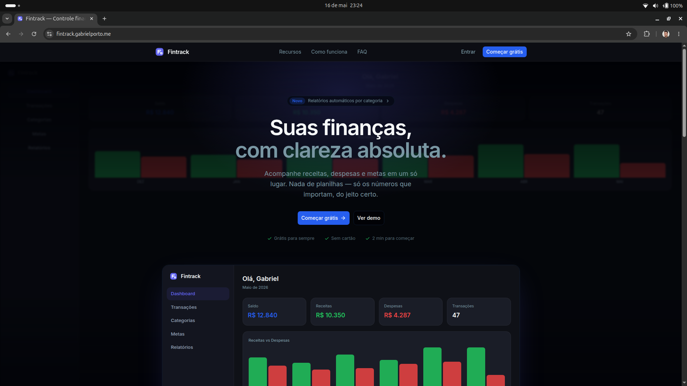
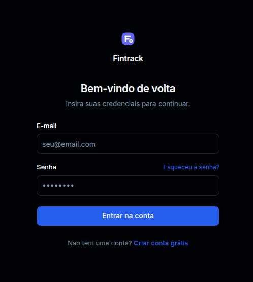
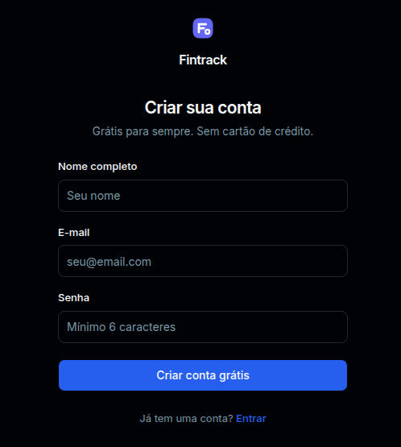
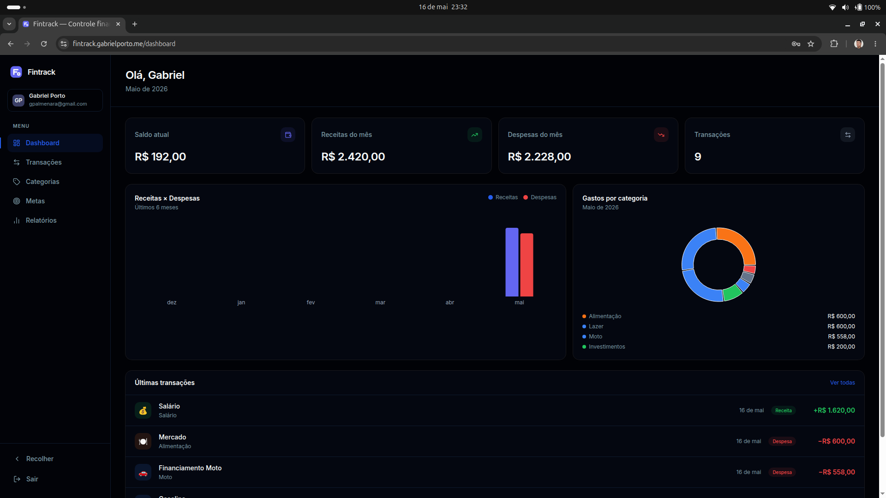
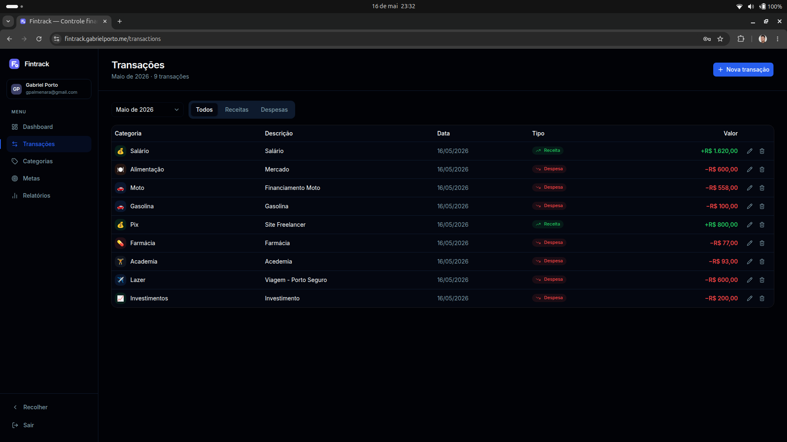
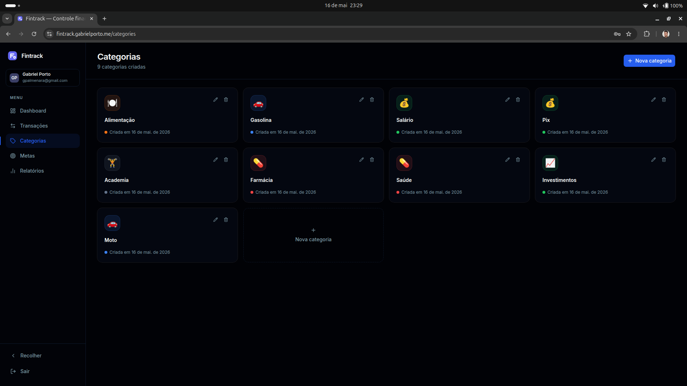
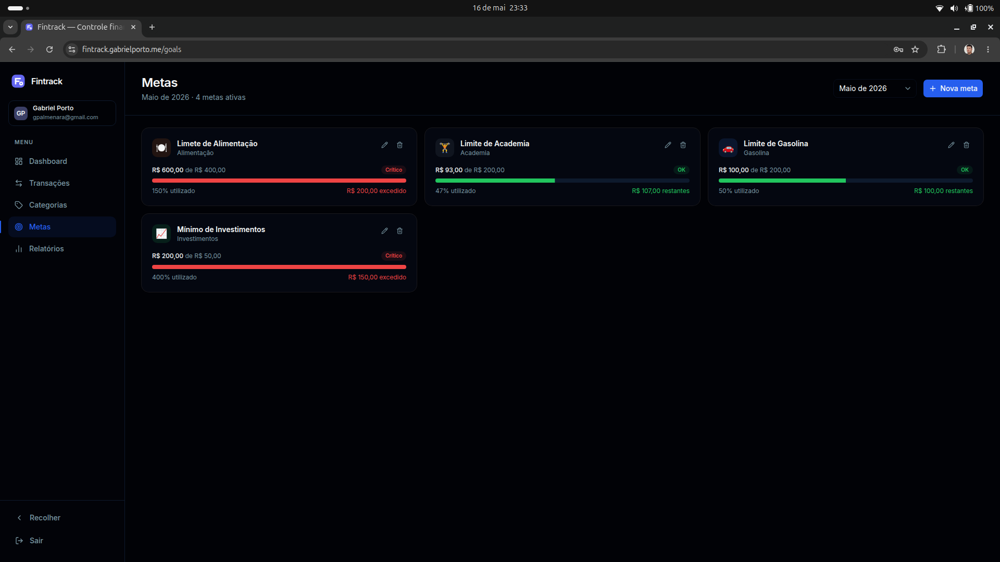
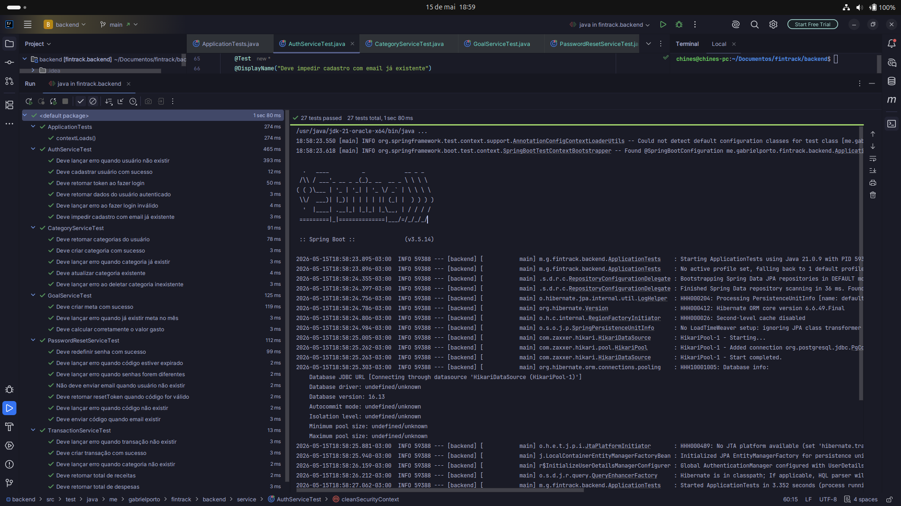

<div align="center">
  
</div>

<div align="center">
  <h1>Fintrack</h1>
  <p><strong>Sistema de finanças pessoais completo — controle suas receitas, despesas e metas mensais.</strong></p>

  
  
  
  
  
</div>

---

## Sobre o projeto

O **Fintrack** é uma aplicação web full stack de finanças pessoais que permite ao usuário controlar suas receitas e despesas, organizar por categorias personalizadas, definir metas mensais de gastos e acompanhar sua evolução financeira através de gráficos e relatórios.

---

## Funcionalidades

- Autenticação completa com JWT (registro, login e recuperação de senha por e-mail)
- Controle de receitas e despesas com categorias
- Categorias personalizadas com cor e ícone
- Metas mensais por categoria com barra de progresso
- Dashboard com gráficos de evolução e resumo financeiro
- Filtro de transações por mês, ano e tipo
- Relatórios com exportação em PDF
- Multi-usuário — cada usuário vê apenas seus próprios dados

---

## Telas

| Landing Page                             | Login                      | Cadastro                         |
| ---------------------------------------- | -------------------------- | -------------------------------- |
|  |  |  |

| Dashboard                          | Transações                           |
| ---------------------------------- | ------------------------------------ |
|  |  |

| Categorias                           | Metas                      |
| ------------------------------------ | -------------------------- |
|  |  |

---

## Arquitetura

```
fintrack/
├── backend/          # API REST em Java com Spring Boot
│   ├── config/       # SecurityConfig, CorsConfig
│   ├── controller/   # Endpoints REST
│   ├── domain/
│   │   ├── entity/   # User, Category, Transaction, Goal, PasswordResetToken
│   │   └── enums/    # TransactionType (INCOME/EXPENSE)
│   ├── dto/
│   │   ├── request/  # Payloads de entrada com validação
│   │   └── response/ # Payloads de saída
│   ├── exception/    # GlobalExceptionHandler, exceções customizadas
│   ├── repository/   # Interfaces JPA com queries customizadas
│   ├── security/     # JwtFilter, JwtService, UserDetailsServiceImpl
│   └── service/      # Regras de negócio (inclui EmailService, PasswordResetService)
│
└── frontend/         # Interface em Next.js com TypeScript
    └── src/
        ├── app/
        │   ├── (auth)/       # Login e Cadastro
        │   └── (dashboard)/  # Área autenticada
        ├── components/       # Componentes reutilizáveis
        ├── contexts/         # AuthContext
        ├── hooks/            # Hooks customizados
        ├── lib/              # Instância do Axios
        └── types/            # Interfaces TypeScript
```

---

## Stack tecnológica

### Back-End

| Tecnologia      | Versão | Uso                                  |
| --------------- | ------ | ------------------------------------ |
| Java            | 21     | Linguagem principal                  |
| Spring Boot     | 3.5.14 | Framework principal                  |
| Spring Security | 6      | Autenticação e autorização           |
| Spring Data JPA | 3.5.14 | Persistência de dados                |
| JWT (jjwt)      | 0.12.6 | Geração e validação de tokens        |
| Bucket4j        | 8.10.1 | Rate limiting                        |
| Resend          | —      | Envio de e-mails (recuperação senha) |
| PostgreSQL      | 16+    | Banco de dados relacional            |
| Lombok          | latest | Redução de boilerplate               |
| Maven           | 3+     | Gerenciamento de dependências        |

### Front-End

| Tecnologia      | Versão | Uso                            |
| --------------- | ------ | ------------------------------ |
| Next.js         | 16.2.6 | Framework React com App Router |
| React           | 19.2.4 | Biblioteca de UI               |
| TypeScript      | 5.x    | Tipagem estática               |
| Tailwind CSS    | 4.x    | Estilização                    |
| shadcn/ui       | 4.7.0  | Componentes de UI              |
| Recharts        | 3.8.1  | Gráficos e visualizações       |
| React Hook Form | 7.75.0 | Gerenciamento de formulários   |
| Zod             | 4.0.0  | Validação de schemas           |
| Axios           | 1.16.1 | Requisições HTTP               |
| jsPDF           | 4.2.1  | Exportação de relatórios PDF   |
| html2canvas     | 1.4.1  | Captura de tela para PDF       |

### Infra

| Tecnologia | Uso                        |
| ---------- | -------------------------- |
| Nginx      | Reverse proxy              |
| PM2        | Gerenciamento de processos |
| Certbot    | SSL/HTTPS                  |

---

## Modelo de dados

```
User
├── id (UUID)
├── name
├── email (unique)
├── password (bcrypt)
└── timestamps

Category
├── id (UUID)
├── name
├── color (hex)
├── icon (lucide)
├── user_id (FK)
└── createdAt

Transaction
├── id (UUID)
├── description
├── amount (BigDecimal)
├── type (INCOME | EXPENSE)
├── date (LocalDate)
├── category_id (FK)
├── user_id (FK)
└── timestamps

Goal
├── id (UUID)
├── name
├── limitAmount (BigDecimal)
├── month
├── year
├── category_id (FK)
├── user_id (FK)
└── timestamps

PasswordResetToken
├── id (UUID)
├── user_id (FK)
├── code
└── expiresAt
```

---

## Endpoints da API

### Auth

| Método | Rota                        | Descrição                       |
| ------ | --------------------------- | ------------------------------- |
| POST   | `/api/auth/register`        | Cadastro de usuário             |
| POST   | `/api/auth/login`           | Login e geração de token        |
| POST   | `/api/auth/forgot-password` | Solicitar código de recuperação |
| POST   | `/api/auth/verify-code`     | Verificar código recebido       |
| POST   | `/api/auth/reset-password`  | Redefinir senha                 |

### Categories

| Método | Rota                   | Descrição                    |
| ------ | ---------------------- | ---------------------------- |
| GET    | `/api/categories`      | Listar categorias do usuário |
| GET    | `/api/categories/{id}` | Buscar categoria por ID      |
| POST   | `/api/categories`      | Criar categoria              |
| PUT    | `/api/categories/{id}` | Atualizar categoria          |
| DELETE | `/api/categories/{id}` | Deletar categoria            |

### Transactions

| Método | Rota                                          | Descrição                  |
| ------ | --------------------------------------------- | -------------------------- |
| GET    | `/api/transactions`                           | Listar todas as transações |
| GET    | `/api/transactions/month?month=5&year=2026`   | Listar por mês             |
| GET    | `/api/transactions/summary?month=5&year=2026` | Resumo do mês              |
| GET    | `/api/transactions/{id}`                      | Buscar por ID              |
| POST   | `/api/transactions`                           | Criar transação            |
| PUT    | `/api/transactions/{id}`                      | Atualizar transação        |
| DELETE | `/api/transactions/{id}`                      | Deletar transação          |

### Goals

| Método | Rota                           | Descrição           |
| ------ | ------------------------------ | ------------------- |
| GET    | `/api/goals?month=5&year=2026` | Listar metas do mês |
| POST   | `/api/goals`                   | Criar meta          |
| PUT    | `/api/goals/{id}`              | Atualizar meta      |
| DELETE | `/api/goals/{id}`              | Deletar meta        |

---

## Como rodar o projeto

### Pré-requisitos

- Java 21+
- Node.js 18+
- PostgreSQL 16+
- Maven 3+
- pnpm

### 1. Clone o repositório

```bash
git clone https://github.com/gabrielportodev/fintrack.git
cd fintrack
```

### 2. Configure e rode o back-end

```bash
cd backend
```

Crie o banco de dados:

```bash
psql -U postgres -c "CREATE DATABASE fintrack_db;"
```

Copie o arquivo de exemplo e preencha com seus dados:

```bash
cp src/main/resources/application.properties.example src/main/resources/application.properties
```

Edite `src/main/resources/application.properties` com suas credenciais:

```properties
# Banco de dados
spring.datasource.url=jdbc:postgresql://localhost:5432/fintrack_db
spring.datasource.username=SEU_USUARIO_POSTGRES
spring.datasource.password=SUA_SENHA_POSTGRES

# JWT — mínimo 256 bits (32 caracteres aleatórios)
jwt.secret=sua-chave-secreta-minimo-256-bits-troque-em-producao
jwt.expiration=3600000

# Resend — crie sua chave gratuita em https://resend.com
resend.api.key=re_SUA_CHAVE_RESEND

# URL do front-end
app.frontend.url=http://localhost:3000
```

Rode o projeto:

```bash
# Com Maven instalado globalmente
mvn spring-boot:run

# Sem Maven instalado (usa o wrapper incluso)
./mvnw spring-boot:run
```

A API estará disponível em `http://localhost:8081`

### 3. Configure e rode o front-end

```bash
cd frontend
```

Copie o arquivo de exemplo e ajuste se necessário:

```bash
cp .env.example .env
```

O arquivo `.env` gerado já aponta para a API local:

```env
NEXT_PUBLIC_API_URL=http://localhost:8081
```

Instale as dependências e rode:

```bash
pnpm install
pnpm dev
```

O front-end estará disponível em `http://localhost:3000`

---

## Testes



Os testes unitários cobrem os serviços principais: `AuthService`, `CategoryService`, `TransactionService`, `GoalService` e `PasswordResetService`.

```bash
cd backend

# Com Maven instalado globalmente
mvn test

# Sem Maven instalado (usa o wrapper incluso)
./mvnw test
```

## Autor

<div align="center">
  
  <br/>
  <strong>Gabriel Porto</strong>
  <br/>
  Desenvolvedor Full Stack | Java & Spring Boot | Next.js & TypeScript

[](https://linkedin.com/in/gabrielportodev)
[](https://github.com/gabrielportodev)
[](https://gabrielporto.me)

</div>

---

<div align="center">
  
</div>
